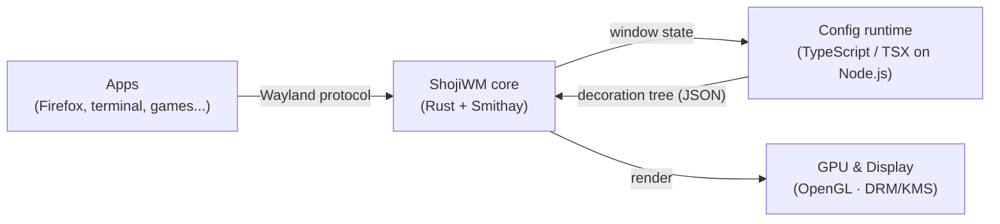
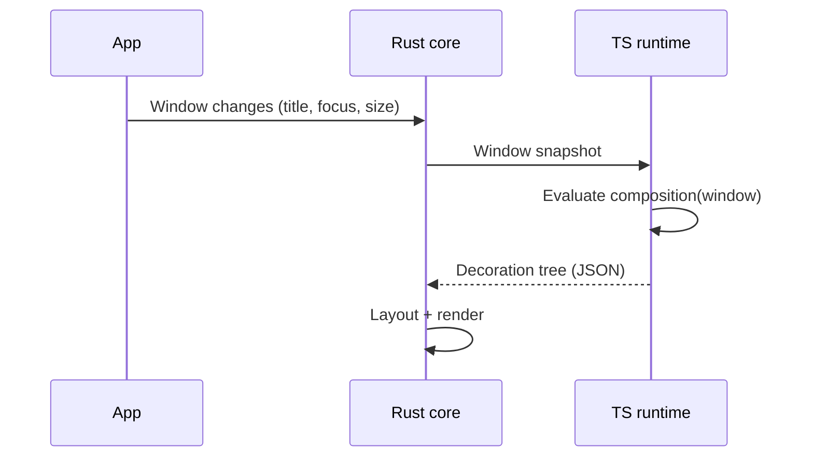

# ShojiWM Architecture

In one sentence: **ShojiWM is a Wayland compositor with a fast core written in
Rust, whose look and behavior you describe in TypeScript/TSX.**

## The big picture



- **Apps** talk to ShojiWM through the standard **Wayland protocol**.
- The **Rust core** handles input, windows, and rendering — the parts that must
  be fast and reliable.
- The **TypeScript config runtime** decides how windows look and behave. You
  write this part.
- The core draws the final frame on the **GPU**.

## Two worlds: Rust core and TypeScript config

ShojiWM splits responsibilities into two processes:

| Layer | Language | Responsibility |
| --- | --- | --- |
| Core | Rust + Smithay | Wayland protocol, input, layout, GPU rendering |
| Config | TypeScript/TSX | Window decorations, layout rules, effects, keybindings |

They communicate over a Unix socket. See the Japanese page for a more detailed,
beginner-friendly walkthrough with sequence diagrams.

## Server-Side Decoration (SSD) flow



## Directory layout

```
src/        Rust core (compositor, IPC, protocol, portal)
packages/   TypeScript SDK (shoji_wm) and user config
```
