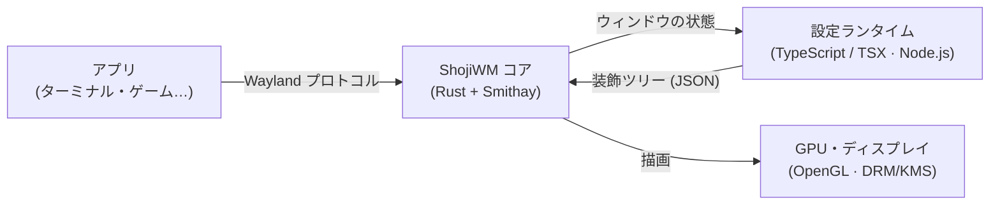
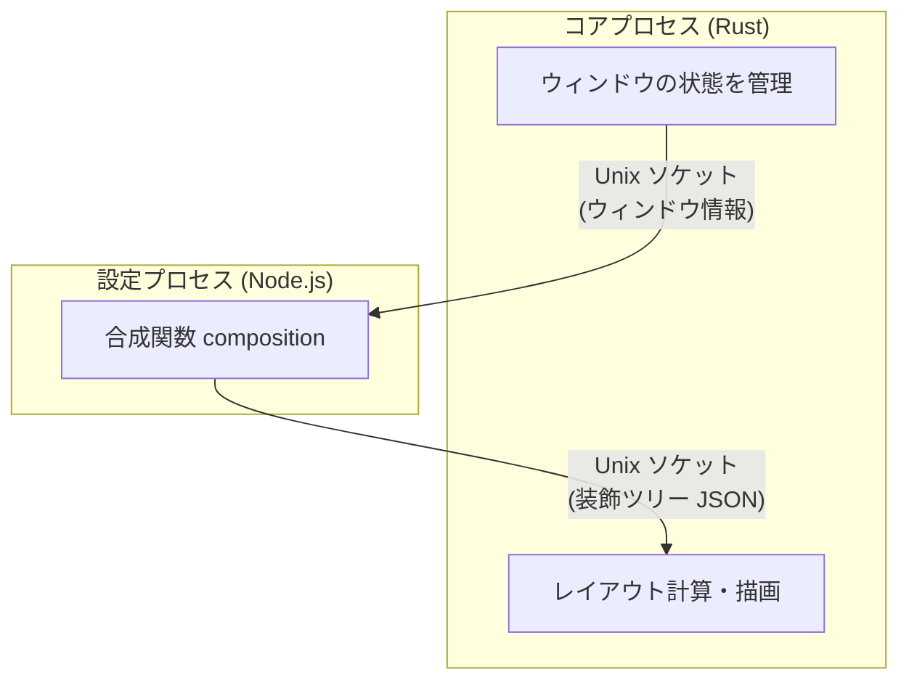
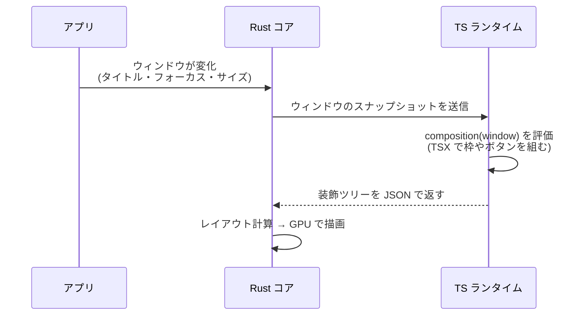
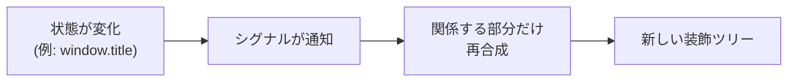

# ShojiWMのアーキテクチャ

一言でいうと、**ShojiWM は「速さが必要な部分を Rust で、見た目や挙動を
TypeScript/TSX で書ける」Wayland コンポジター**です。

このページでは、ShojiWM に興味を持った方に向けて、内部がどう動いているかを
順を追って解説します。専門用語はそのつど補足するので、Wayland やコンポジターを
初めて聞く方でも読み進められます。

## そもそも「コンポジター」とは？

GUI のデスクトップでは、たくさんのアプリ（ブラウザ、ターミナル、ゲームなど）が
それぞれ自分の絵（ウィンドウ）を描きます。これらをひとつの画面に
**重ね合わせて（composite して）** 最終的な映像を作り、ディスプレイに表示する
役割を持つソフトウェアが **コンポジター** です。

Wayland の世界では、このコンポジターが同時に「ウィンドウマネージャ
（どのウィンドウをどこに、どんな大きさで置くか）」の役割も兼ねます。
ShojiWM はこの両方を担当します。

:::tip
Wayland 自体については [Waylandとは](./wayland.md) を先に読むと理解がスムーズです。
:::

## 全体像

ShojiWM は大きく4つの登場人物で成り立っています。

- **アプリ** は標準の **Wayland プロトコル**を通じて ShojiWM と会話します。
  アプリ側は「相手が ShojiWM である」ことを意識する必要はありません。
- **Rust コア** は、入力・ウィンドウ・描画といった「速くて壊れてはいけない」
  部分を担当します。
- **設定ランタイム（TypeScript）** は、ウィンドウの見た目や挙動を決めます。
  **あなたが書くのはこの部分**です。
- 最終的な映像は **GPU** で合成され、ディスプレイに出力されます。

## 2つの世界 ― なぜ Rust と TypeScript に分かれているのか

ShojiWM の最大の特徴は、役割を **2つの層** にきれいに分けていることです。

| 層 | 言語 | 担当すること |
| --- | --- | --- |
| コア | Rust + Smithay | Wayland プロトコル、入力処理、レイアウト計算、GPU 描画 |
| 設定 | TypeScript/TSX | ウィンドウの装飾、配置ルール、エフェクト、キーバインド |

なぜ分けるのでしょうか？

- **コア（Rust）** は毎フレーム動く心臓部です。1秒間に何十回も実行されるため、
  速度とメモリ安全性が重要です。そこで Rust と、Wayland コンポジター用ライブラリ
  [Smithay](https://github.com/Smithay/smithay) を使っています。
- **設定（TypeScript）** は「見た目や好み」を表現する部分です。ここは書きやすさと
  柔軟さが大切なので、Web 開発でおなじみの TypeScript/TSX で書けるようにして
  います。React に似た書き心地で、ウィンドウの枠やボタンを組み立てられます。

この2つは **別々のプロセス**として動き、**Unix ソケット**という仕組みで会話します。

:::note
プロセスを分けることで、設定（TypeScript）を**書き換えて再読み込み（ホットリロード）**
してもコアは動き続けられます。セッションを落とさずに見た目を反復開発できる、という
わけです。
:::

## SSD（サーバーサイド・デコレーション）の流れ

ウィンドウの「枠・タイトルバー・影」などの装飾を **誰が描くか** には2つの流儀が
あります。

- **クライアントサイド装飾 (CSD)**: アプリ自身が枠を描く
- **サーバーサイド装飾 (SSD)**: コンポジター（＝サーバー）側が枠を描く

ShojiWM は **SSD** を採用し、しかもその「どう描くか」を **あなたの TypeScript
コード**に任せます。流れを時系列で見てみましょう。

1. アプリのウィンドウに変化が起きます（例：タイトルが変わった、フォーカスされた）。
2. コアがそのウィンドウの**スナップショット**（現在の状態の写し）を TS ランタイムへ
   送ります。
3. TS ランタイムが、あなたの書いた **合成関数 `composition(window)`** を実行し、
   「このウィンドウをどう飾るか」を TSX で組み立てます。
4. 結果を **JSON（装飾ツリー）** にしてコアへ返します。
5. コアがそれを受け取り、レイアウトを計算して GPU で描画します。

つまり、あなたが TSX で `<WindowBorder>` や `<Button>` を書くと、それが JSON に
変換されてコアに渡り、実際の画面の枠やボタンになる、という仕組みです。

## リアクティブな仕組み（シグナル）

「タイトルが変わったら枠の表示も自動で変わってほしい」――こうした**自動更新**を
支えているのが **シグナル (signal)** という仕組みです。

ポイントは「**変化に関係する部分だけ**を再計算する」ことです。画面全体を毎回
作り直すのではなく、必要な部分だけを更新するので効率的です。React の状態管理を
触ったことがある方なら、感覚は近いはずです。

## まとめ

- ShojiWM は **Rust の高速なコア**と **TypeScript の柔軟な設定層**の2層構造。
- 両者は **別プロセス**で動き、**Unix ソケット**で会話する。
- ウィンドウの装飾は **SSD**で行い、その「描き方」を **あなたの TSX コード**が決める。
- **シグナル**により、状態の変化に応じて必要な部分だけが自動で再合成される。

次に進むなら、[設定の概要](../configuration/overview.md) で実際のコードの書き方を
見てみてください。
